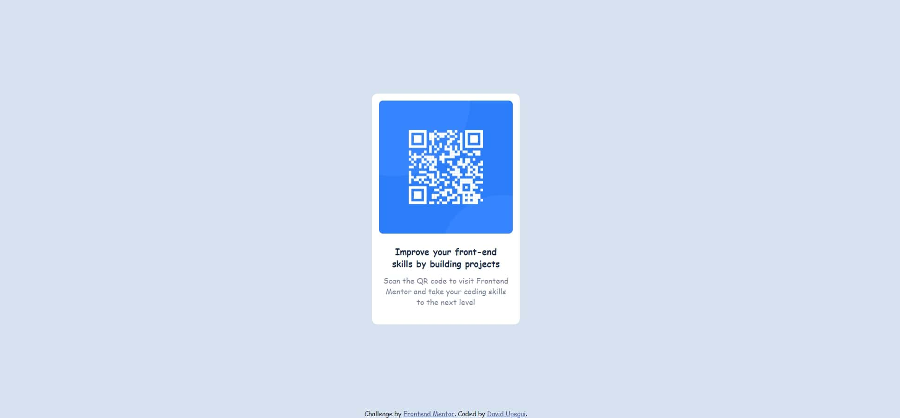

# Frontend Mentor - QR code component solution

This is a solution to the [QR code component challenge on Frontend Mentor](https://www.frontendmentor.io/challenges/qr-code-component-iux_sIO_H). Frontend Mentor challenges help you improve your coding skills by building realistic projects. 

## Table of contents

- [Overview](#overview)
  - [Screenshot](#screenshot)
  - [Links](#links)
- [My process](#my-process)
  - [Built with](#built-with)
  - [What I learned](#what-i-learned)
  - [Continued development](#continued-development)
  - [Useful resources](#useful-resources)
- [Author](#author)

**Note: Delete this note and update the table of contents based on what sections you keep.**

## Overview
### Screenshot

### Links
- Solution URL: [Add solution URL here](https://your-solution-url.com)
- Live Site URL: [Add live site URL here](https://your-live-site-url.com)

## My process
### Built with
- Semantic HTML5 markup
- CSS custom properties
- Flexbox

### What I learned
I learn a lot about the flex system. Theorically I have the theory about css (flex) but I hadn't had the opportunity for apply it an this excersice was perfect for that.

### Continued development
The use of the classes in the project: when and where to use a class or just use de html tag?. Also, I think that the structure can be improved.

### Useful resources
- Basically Google search.

## Author
- Frontend Mentor - [@DavidUpegui](https://www.frontendmentor.io/profile/DavidUpegui)

